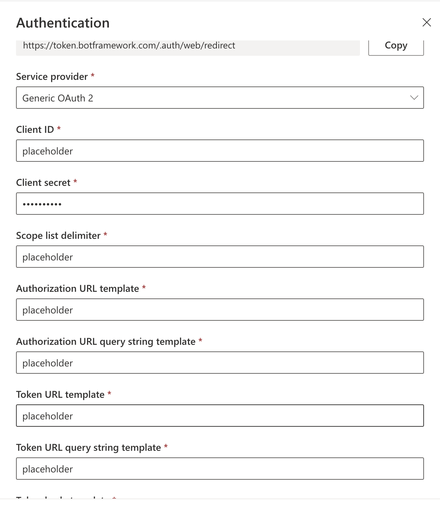

# Firebase Auth In Copilot Studio

This custom canvas demonstrates how an access token obtained from Firebase, that can be used in the flow with Microsoft Copilot Studio. In this example SAML authentication with `signInWithPopup` is used. 

## Prerequisites

* Firebase application has been created in Firebase console
* SAML authentication was selected and configured for the application

## Detailed instructions

### Populate configuration values in [Index.html](public/index.html) 


Obtain Firebase app configuration from [Firebase Console](https://console.firebase.google.com):

- Select Project Overview from the left pane.
- Select your app and click the settings button.
- Scroll down and find the section that shows the config settings for the app.
- Update the value of `firebaseConfig` variable. 

It should look like this:

 ```
const firebaseConfig = {
  apiKey: "D345rdfdfgfdgf2yDcmqcQ",
  authDomain: "appid.firebaseapp.com",
  projectId: "appid",
  storageBucket: "appid.appspot.com",
  messagingSenderId: "1713453418579",
  appId: "1:1713453499:web:6ca435dgdfg2ec6",
  measurementId: "G-324WRGERT"
};
```

                 
- `tokenEndpoint` - Copilot's token endpoint. In the Copilot Studio open Settings of the copilot, select Channels, Select Mobile app, copy the value of 'Token Endpoint'.  
- `provider` - Obtain the SAML provider Id (should be similar to saml.dev) from Firebase console (Authentication->Sign-in Method. 
                                                          
### Deploy the sample files

Deploy [index.html](./public/index.html) on a local or a remote server. For example: [http://localhost:80/index.html](http://localhost:8080/index.html) 

Add the website url to the list of authorized domains in Firebase console. 

- Open the project in the [Firebase Console](https://console.firebase.google.com).
- In the Authentication section, open the Settings page.
- Add the URL of the website to the list (needed for `localhost` as well)
   

### Configure authentication in Copilot Studio

This pattern will work for copilots configured with [manual authentication and any OAuth authentication provider](https://learn.microsoft.com/en-us/microsoft-copilot-studio/configuration-end-user-authentication#manual-authentication-fields). Since it is a passthrough pattern, in which the token is sent to Copilot Studio, but not validated, it will even work when no values are provided for an authentication provider. To configure manual authentication without providing any real values, select "Generic OAuth 2.0" and enter **placeholder** in required fields.

<p align="center">
  
  <br>
  <em>Manual authentication without real values</em>
</p>


#### IMPORTANT !
- When using "placeholder" instead of real values, SSO will not work in the test canvas, and users will not be able to sign-on using the standard "login card".
- After making any changes to the copilot, **publish the copilot** for changes to take effect.


### Test the Auth flow

After signing-in using the Firebase popup, the user's access token will be sent to Copilot Studio and stored in ***System.User.AccessToken***, which can be used by copilot to make calls to protected APIs.

<p align="center">
  
  <br>
  <em>System.User.AccessToken is populated</em>
</p>

### Links and References

[Copilot 3rd Party SSO with OKTA](https://github.com/microsoft/CopilotStudioSamples/blob/master/3rdPartySSOWithOKTA/README.md)

[Copilot  Sign-on with a generic OAuth provider](https://learn.microsoft.com/en-us/microsoft-copilot-studio/configure-sso-3p)

[Customize the look and feel of a copilot](https://learn.microsoft.com/en-us/microsoft-copilot-studio/customize-default-canvas?tabs=web#customize-the-default-canvas-simple)

[Firebase SAML](https://firebase.google.com/docs/auth/web/saml#web_4)
